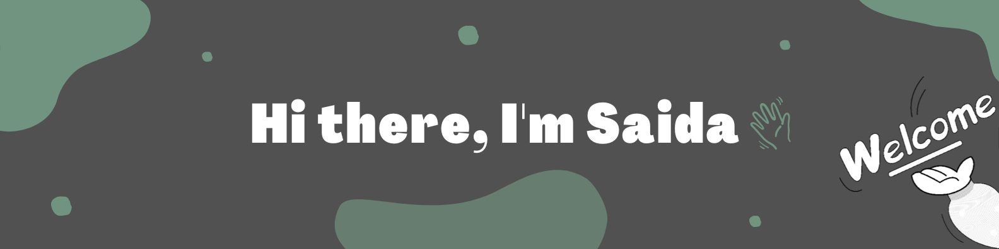

  

 
- 🔭 I’m currently working on: **BookFinder**

- 🌱 I’m currently learning: **React**

- 📫 How to reach me: **saidahussen4@gmail.com**

- ⚡ Fun fact: **voracious reader 📖**

<h4 align="left">Connect with me:</h4>

---

<h4 align="left">Languages and Tools:</h4>

    <a href="https://www.docker.com/" target="_blank" rel="noreferrer"> 
    &nbsp; </a> 
    <a href="https://www.python.org" target="_blank" rel="noreferrer"> 
    &nbsp; 
  </a>
    <a href="https://www.djangoproject.com/" target="_blank" rel="noreferrer"> 
    &nbsp;
  </a>
    <a href="https://www.sqlite.org/" target="_blank" rel="noreferrer"> 
    &nbsp;
  </a>
    <a href="https://www.w3.org/html/" target="_blank" rel="noreferrer"> 
    &nbsp; 
  </a> 
    <a href="https://www.w3schools.com/css/" target="_blank" rel="noreferrer"> 
  &nbsp; 
  </a> 
    <a href="https://developer.mozilla.org/en-US/docs/Web/JavaScript" target="_blank" rel="noreferrer"> 
    &nbsp;
  </a> 
  <a href="https://getbootstrap.com" target="_blank" rel="noreferrer"> 
  &nbsp; 
  </a> 
 
  <a href="https://www.figma.com/" target="_blank" rel="noreferrer"> 
    &nbsp; 
  </a>
  <a href="https://git-scm.com/" target="_blank" rel="noreferrer"> 
    &nbsp;
  </a>

  <a href="https://www.adobe.com/in/products/illustrator.html" target="_blank" rel="noreferrer"> 
    &nbsp;
  </a>

  <a href="https://www.photoshop.com/en" target="_blank" rel="noreferrer"> 
    &nbsp;
  </a> 
  <a href="https://www.adobe.com/products/xd.html" target="_blank" rel="noreferrer"> &nbsp; </a> 

  
  -----
  
  #### 🔥 My Stats:
<!--    -->

